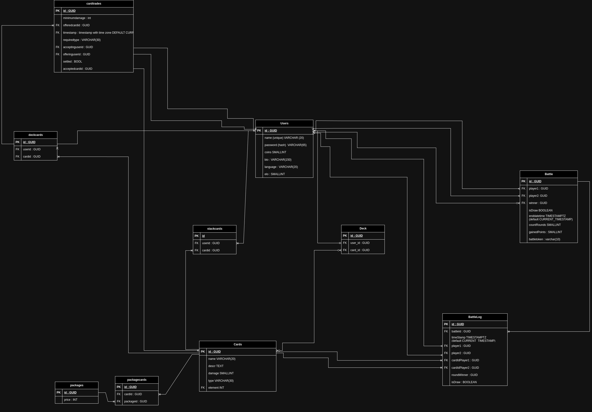

Assignmenet for SWEN course at FH Technikum Wien

# Monster Card Trading Game - MTCG

## Custom features
## Multi-language
> In hindsight it would have been nice to have a single TranslationService that handles language preferences concerning every output and works a bit more general than the dedicated classes now do - but I only thought of this when I already finished the `ResponseTextTranslator`.
+ there's a german and an english translation for every status message and for the battle gameplay output that the clients receive
+ `BattleConfig` and `ResponseTranslationService` read `.json` files via `JsonConfigLoader` and extract the relevant information
+ the prefered language gets stored inside the config objects and redundantly also in the `Session` and the `User`

## Battle Card Thief
+ `BattleManager.TryToStealCard`
+ a randomly chosen battle player tries to steal a card from the other player and succedes with a probability defined in `config.json` `battle: ChanceOfStealing: number` 
+ Result gets stored in the `Battle` object

## Logout
+ Users can logout
+ Session gets destroyed

## Various endpoints
A few endpoints that were not required but made the development eaiser (e.g. resetting, trying out different scenarios).


# Architecture
## Database schema


## Services & Configs
### `ServiceProvider`
+ Registeres config objects implementing the `IService` interface.
+ Provides config objects and corresponding data via static *getter*s.
+ Entities can be statically registered or just by their type, so that when `GetDisposable` is called, a fresh instance is returned.

### `IConfig`
+ contract for `*Config` objects
+ contains information on where to find config data (json-files) and under which section (json object key)
+ provides name for config object to prevent overriding of the same config object
+ Loads data for config objects from file path that is passed via `Load` method.
+ some configs files can be changed at runtime and still have an effect on the application, e.g. the configurations for the battle
  + number of rounds per battle
  + required amount of cards in the deck
  + probability of card theft
  + translations
  + ...

---
## `Controller`
+ are identified by the custom attribute `ControllerAttribute`
+ handle client requests by implementing dedicated methods
+ dedicated Endpoint methods are identified by the custom attribute `RouteAttribute`
+ receive a `Request` object from the `Router` class
+ handle database operations via implementations of the abstract `BaseRepository` class
+ methods with the `RouteAttribute` return a `IResponse` object (or `Task<IResponse>`) to the router

## `Router`
+ Performs all the request/response handling.
+ delegates the work to designated entities.
+ `ClientHasPermission` checks access rights
+ `InitUserSettings` sets prefered language
+ `CreateControllerInstance` creates an instance of the controller responsible for handling the request.
+ `InvokeControllerMethod` invokes the controller method responsible for handling the request.
+ ends the anonymous session if the request is an anonymous request.
+ handles certain exceptions

## `UrlParser`
+ uses URL templates to generate a *regex* pattern that can be used to extract named parameters and query parameters transmitted via the URL
+ checks if requested URL matches a specific generated pattern
+ provides key-value pairs of named parameters/query parameters and their values

## `RouteRegistry`
+ used to register endpoint handlers
+ can be used together with `ReflectionRouteObtainer` to register `Endpoint` objects
+ `MapRequestToEndpoint(ref IRequest request)` uses `UrlParser` to check if one of the registered URLs matches the incoming client request concerning the HTTP method, access rights, expected named parameters, ...
+ in case a endpoint was found, it completes the provided `IRequest` object with the `Endpoint` object
+ throws a `RouteDoesntExistException` in case no registered endpoint fits the request


## `RouteAttribute`
+ used to register methods as endpoint handlers
E.g. `[Route("/users/{username:alphanum}", HTTPMethod.PUT, Role.USER | Role.ADMIN)]`
+ the url defines a template for the `UrlParser` class, that generates a *Regex* pattern from it to handle named parameters and query strings
+ HTTPMethod.*MethodName* HTTP-method
+ `Role.*` define the access level a client must have to be able to access this endpoint
	+ get stored as `Enum` because bitwise operations make it pretty easy to check and compare the permission level even with access groups
		+ e.g. `Role.ALL = Role.USER | Role.ADMIN | Role.ANONYMOUS`

## `ReflectionRouteObtainer`
+ scans the source code for the `ControllerAttribute`s and `RouteAttribute`s to register the endpoints along with their corresponding:
	+ controller types and controller methods
	+ access rights
	+ URL templates (patterns)
	+ URL Regex patterns
	+ ...


## `ReflectionUtils`
+ used in `Router.HandleRequest` to map variable arguments in the URI to the expected parameter list in the controller methods that handle an endpoint
+ one implementation of `MapArgumentsAndInvoke` handles synchronized method calls and one asynchronous method calls
+ since the named params are received as type `string`, they get converted/cast/parsed to the data types of the parameters defined in the controller methods by `ReflectionUtils.MapProvidedArgumentsToSignature`
	+ e.g.  `alphanum` translates to "alphanumeric" value
	+ the alphanumeric value will get parsed as type Guid

```
[Route("/users/{userid:alphanum}, HTTPMethod.DELETE, Role.ADMIN | Role.USER)]
public IResponse DeleteUser(Guid userid)
```

## `Repository`
+ provides interface to get data from database

## `SessionManager`
+ Stores each created `Session` in a static dictionary. The inidivual sessions provide client details (if logged in) among other things.
+ stores anonymous sessions
+ stores the user specific session by hashing and ofdbuscating the authentication token as the key in the session dictionary

## `Session`
+ stores `User`, Authentication token, prefered language, if the user is logged or if its an anonymous session


## `IModel`
+ implementations represent common entities related to the app:
	+ `User`
	+ `Card`
		+ `DeckCard`
		+ `StackCard`
	+ `Deck`
	+ `Battle`
	+ `BattleLogEntry`
	+ `Trade`
	+ `Package`
+ method `object ToSerializableObj()` used to provide `Request` a easily serializable object that contains only the fields the user is supposed to see

## `Response`
+ Response objects implement `abstract class BaseJsonResponse : IResponse`
+ responsible for **serializing** the payload
+ if payload is `IModel` => make use of their `object ToSerializableObj` method that only exposes the fields that the client is supposed to see, whislt ignoring sensitive or irrelevant information like `User::Password` etc. and takes care of providing nested `IModel` objects (in case there are any).
+ contains:
	+ payload as serialized JSON string
	+ payload as instance of `IModel`
	+ response code and optional description

## `Request`
+ used to store client request
+ contains:
	+ HTTP headers
	+ `SessionId`
	+ payload
	+ `Endpoint`
	+ etc.
+ `T? PayloadAsObject<T>()` tries to deserialize payload
+ gets passed to `IController` implementations

## `BattleManager`
+ handles the battle logic
+ gets instantiated in the `BattleWaitingRoomManager`
+ returns a `IModel Battle` object containing `BattleLogEntry` objects reprasenting the individual game round to the `BattleWaitingRoomManager`, which in turn returns it to the `BattleController`

## `BattleWaitingRoomManager`
+ handles the queue where lonesome players wait for an opponent
+ uses `ConcurrentDictionary<User, TaskCompletionSource<Battle>>` to store a pending battle request
+ as soon as two players are paired up for a battle, the `PerformBattle` method gets mutexed and the `BattleManager` proceedes with the battle on a single thread

## `QueryBuilder`
+ uses simple string concatenation to simplfy and shorten the expressions needed to write to query the database
+ pretty badly written, but it did the job
+ e.g.
[QueryBuilder usage example.](assets/queybuilder.png)


# Tests
## Unit tests
Writing unit tests felt like a tedious task in the beginning, but turned out to be incredibly useful. Especially writing the tests before implementing the tested classes and methods. It helped with thinking things through, structuring the code a bit better and in the end accelerated the whole development process by automating the testing and not being dependend so much on trial and error processes.
### Chosen testcases
I tried to choose mainly critical sections of the code like the `UrlParser`, the `RouteRegistry`, loading data from the config files, the battle logic. 

### Integration tests
+ implemented in python
+ check status codes and payloads (case dependent)
